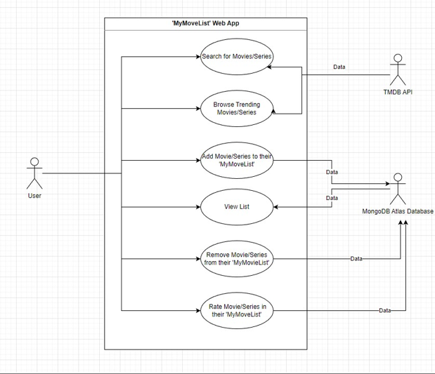

# MyMovieList
A web app which allows users to keep a list of movies/series they have seen.

 

 ## Description
 This project is an app with which users can keep track of movies/series they have seen. A lot 
of streaming services have a similar feature; however, users can only add titles that are on
that streaming service. ‘MyMovieList’ is a solution to this, as it allows one to keep track of 
what they have watched, across all platforms, using the TMDB API.

 ## Technologies Used
* HTML, CSS, JS
* FetchAPI
* MongoDB
* NodeJS
* ExpressJS
* Mongoose
* TMDB API
* Figma
* UML
* Gannt chart

## Design

### Frontend
The fronend for the app was built with vanilla HTML, CSS, and JS to create a user-friendly and responsive interface.

### Backend
For backend storage the app employs a MongoDB Atlas Database to handle data saved by the user from the TMDB API.

## Resources
### 'Getting Real' by 37 signals
This book details best practices when it comes to developing a web application. It promotes starting on the actual product that users will see and use (the UI) and working from there, rather than starting with the theory/functionality. I incorporated these ideas it the production of the project.

### ‘What is A/B testing?’ by Oracle
This fantastic article by Oracle help me to learn about and understand the importance of A/B testing, and how to best conduct tests for the project.
https://www.oracle.com/ie/cx/marketing/what-is-ab-testing/

